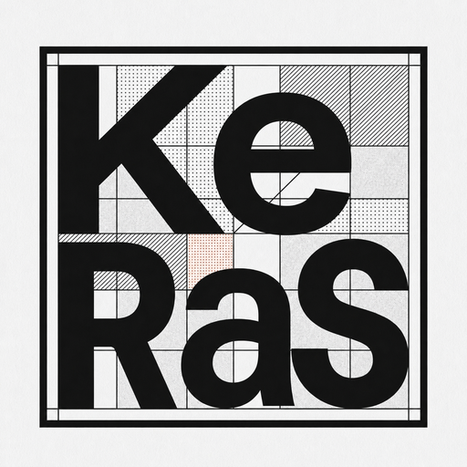
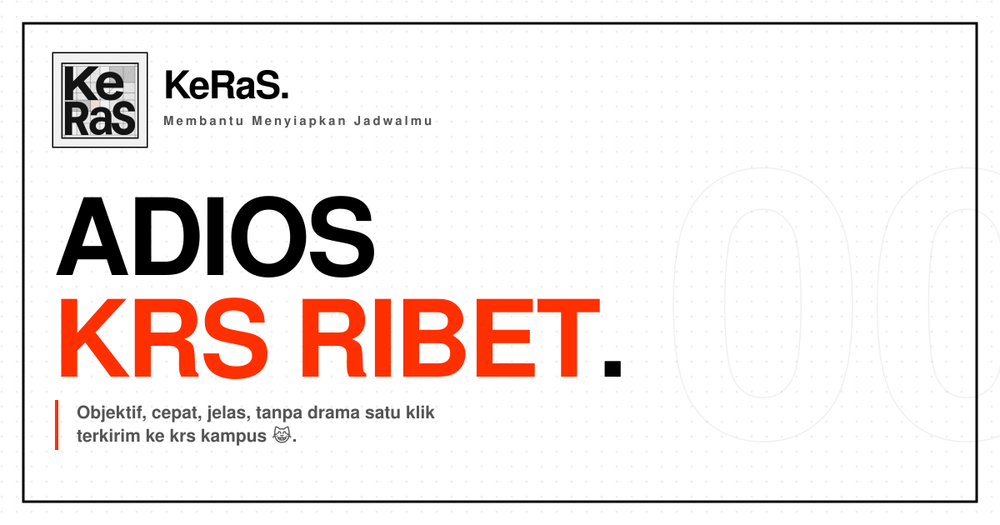

<div align="center">
  

# KeRaS

**Membantu Menyiapkan Jadwalmu** open-source KRS automation and scheduling tool built through reverse engineering of web-based university KRS systems.



</div>

## Table of Contents

* [What is KeRaS?](#what-is-keras)
* [Reverse Engineering Approach](#reverse-engineering-approach)
* [How KeRaS Works](#how-keras-works)
* [Features](#features)
* [Tech Stack](#tech-stack)
* [Getting Started](#getting-started)

  * [Prerequisites](#prerequisites)
  * [Environment Variables](#environment-variables)
  * [Run Locally](#run-locally)
* [Self-Hosting with Docker](#self-hosting-with-docker)

  * [1. Basic Setup](#1-basic-setup)
  * [2. Adding Shlink](#2-adding-shlink-for-share-schedule)
  * [3. Production Deploy](#3-production-deploy-prebuilt-image-from-ghcr)
* [Architecture](#architecture)
* [Roadmap](#roadmap)
* [Contributing](#contributing)
* [Getting Help](#getting-help)

---

## What is KeRaS?

KeRaS is a web-based KRS (Kartu Rencana Studi) assistant designed to simplify course planning and submission for university students.

Instead of replacing the university's KRS system, KeRaS acts as an integration and automation layer between the student and the existing system.

The core of KeRaS was developed by analyzing the communication behavior of web-based KRS applications and reproducing the required communication flow on the server side.

This allows KeRaS to:

* retrieve course and schedule data from the university KRS system;
* maintain the required session context;
* reproduce the requests required for KRS operations;
* automate repeated submission attempts;
* provide a unified scheduling interface;
* generate schedules based on user-defined constraints.

KeRaS does not require the university KRS system to expose a dedicated public API.

---

## Reverse Engineering Approach

### Overview

The integration layer of KeRaS is based on **web application reverse engineering**.

University KRS systems are commonly designed primarily for browser-based interaction. Their internal endpoints, request structures, session mechanisms, and communication flows may not be exposed as documented public APIs.

KeRaS analyzes the observable behavior of these systems to understand how the browser communicates with the KRS backend.

The resulting implementation reproduces only the communication required for the supported KRS workflows.

### What is Analyzed?

The reverse engineering process focuses on the application's observable communication layer, including:

* HTTP endpoints;
* HTTP methods;
* request parameters;
* request and response structures;
* headers required by the application;
* authentication and session behavior;
* course and schedule data structures;
* submission request flow;
* server response and success/failure conditions.

Conceptually:

```text
University KRS Web Application
            │
            ▼
   Browser Network Traffic
            │
            │ Analysis
            ▼
 ┌──────────────────────────┐
 │ Communication Flow       │
 │ • Endpoints              │
 │ • Requests               │
 │ • Parameters             │
 │ • Sessions               │
 │ • Responses              │
 └────────────┬─────────────┘
              │
              │ Reimplementation
              ▼
       KeRaS Integration Layer
              │
              ▼
       University KRS System
```

### Reverse Engineering vs. Scraping

KeRaS should not be described solely as a scraper.

Traditional scraping generally focuses on extracting information from rendered pages:

```text
HTML Page → Parse → Extract Data
```

KeRaS goes further by understanding the underlying application communication:

```text
KRS Web Application
        │
        ├── Page structure
        ├── API / HTTP endpoints
        ├── Request parameters
        ├── Session state
        └── Submission flow
                 │
                 ▼
              KeRaS
```

Scraping is therefore only one component of the broader integration strategy.

---

## How KeRaS Works

The core architecture can be simplified as:

```text
┌───────────────┐
│    Student    │
└───────┬───────┘
        │
        ▼
┌───────────────────────────┐
│          KeRaS            │
│                           │
│  Schedule Planning        │
│  Course Discovery         │
│  AI Schedule Generation   │
│  KRS Automation            │
└────────────┬──────────────┘
             │
             │ Server-side communication
             ▼
┌───────────────────────────┐
│ University KRS System     │
│                           │
│ Existing Web Application  │
└───────────────────────────┘
```

### 1. Session Establishment

The user authenticates through the supported university KRS system.

KeRaS establishes and maintains the necessary session context required to communicate with the KRS backend.

No permanent KRS credentials or personal academic data are stored by KeRaS.

### 2. Course Data Retrieval

KeRaS communicates with the KRS backend to retrieve currently available course and schedule information.

The retrieved data is normalized into a structure that can be consumed by the KeRaS scheduling interface.

```text
KRS Backend
    │
    ▼
HTTP Response
    │
    ▼
KeRaS Parser
    │
    ▼
Normalized Course Data
    │
    ▼
Schedule Interface
```

### 3. Schedule Planning

Students can view available courses in a unified interface instead of navigating through the original KRS interface.

The scheduling engine can evaluate:

* target SKS;
* preferred days;
* preferred hours;
* course preferences;
* lecturer preferences;
* schedule conflicts;
* optimization objectives.

### 4. AI Schedule Generation

KeRaS can optionally use an OpenAI-compatible model to generate candidate schedules.

The model does not directly determine whether a schedule is valid.

Generated schedules are validated against the actual course data and hard constraints before being presented to the user.

```text
User Preferences
       │
       ▼
AI Model
       │
       ▼
Candidate Schedule
       │
       ▼
Constraint Validation
       │
       ├── Invalid → Reject
       │
       └── Valid → Present
```

### 5. KRS Submission Automation

After the student selects a schedule, KeRaS can reproduce the required KRS submission flow.

The process is conceptually:

```text
Selected Courses
      │
      ▼
KeRaS Submission Layer
      │
      ├── Session Context
      ├── Required Parameters
      └── Submission Request
              │
              ▼
       University KRS
              │
              ▼
        Response Analysis
              │
        ┌─────┴─────┐
        ▼           ▼
     Success      Failure
```

The **"Perang Submit"** feature can repeatedly perform the supported submission operation when the university system is experiencing high contention.

Success ultimately depends on the university's own KRS backend and its admission/validation rules.

---

## Features

| Feature                                | Description                                                                                                     |
| -------------------------------------- | --------------------------------------------------------------------------------------------------------------- |
| **Reverse-Engineered KRS Integration** | Reproduces the required communication flow between the browser and the university KRS backend.                  |
| **Unified View**                       | Displays available course schedules in a single interface.                                                      |
| **Perang Submit**                      | Automates repeated KRS submission attempts when supported by the target system.                                 |
| **Session Bridging**                   | Uses the user's active KRS session as the communication context between KeRaS and the university system.        |
| **Realtime Data Retrieval**            | Retrieves current course and schedule information from the university KRS backend.                              |
| **AI Schedule Generation**             | Generates constraint-aware schedule candidates using an OpenAI-compatible model.                                |
| **Schedule Validation**                | Validates generated schedules against actual course data and hard constraints.                                  |
| **Share & Adopt Schedule**             | Shares schedules through short links and allows recipients to adopt matching courses from the current offering. |
| **Zero Database**                      | KeRaS itself does not require a persistent application database for user academic data.                         |
| **Anonymous Analytics**                | Optional PostHog analytics with NIM masking.                                                                    |
| **Server-side Bridging**               | Keeps KRS communication on the server side instead of exposing internal KRS endpoints directly to the client.   |

---

## Tech Stack

* **Framework:** [Next.js 16](https://nextjs.org) (App Router) + React 19 + TypeScript
* **Styling/UI:** Tailwind CSS 4, Radix UI, GSAP + Motion
* **Forms/Validation:** React Hook Form + Zod
* **KRS Integration:** Axios + Cheerio
* **Reverse-Engineered Communication:** HTTP-based server-side integration with the target KRS application
* **Analytics:** PostHog (anonymous, NIM-masked)
* **AI:** Any OpenAI-compatible endpoint
* **Link Shortening:** Shlink
* **Runtime/Package Manager:** [Bun](https://bun.sh)

---

## Getting Started

### Prerequisites

* [Bun](https://bun.sh) installed
* Access to the target university KRS endpoints
* Appropriate authorization to use the target KRS system

### Environment Variables

Copy `.env.example` to `.env`.

```bash
# Analytics
NEXT_PUBLIC_POSTHOG_PROJECT_TOKEN="phc_xxx"
NEXT_PUBLIC_POSTHOG_HOST="https://us.i.posthog.com"

# AI Schedule Generation
AI_API_KEY=""
AI_BASE_URL="https://api.openai.com/v1"
AI_MODEL="gpt-4o-mini"

# Share Schedule
SHLINK_BASE_URL="http://localhost:8080"
SHLINK_API_KEY=""
APP_URL="http://localhost:3000"
```

The target KRS integration is configured through the `KRS_*` environment variables.

### Run Locally

```bash
git clone https://github.com/dendik-creation/keras.git
cd keras

bun install

bun run dev
```

Open:

```text
http://localhost:3000
```

---

## Self-Hosting with Docker

KeRaS ships with:

* `Dockerfile` multi-stage Bun + Next.js standalone build;
* `docker-compose.yml` local source-based deployment;
* `docker-compose.prod.yml` production deployment using the prebuilt GHCR image.

### 1. Basic Setup

Create the shared Docker network:

```bash
docker network create apps
```

Copy `.env.example` to `.env`, configure the required `KRS_*` values, then:

```bash
docker compose up -d --build
```

The default application port is `3000`.

It can be changed using:

```env
PORT=8080
```

### 2. Adding Shlink for Share Schedule

Share Schedule optionally uses Shlink as an internal URL-shortening service.

```yaml
services:
  shlink:
    image: shlinkio/shlink:stable
    container_name: shlink
    restart: unless-stopped
    environment:
      DEFAULT_DOMAIN: share.yourdomain.internal
      IS_HTTPS_ENABLED: "false"
      DB_DRIVER: sqlite
    volumes:
      - shlink_data:/etc/shlink/data
    networks:
      - apps

volumes:
  shlink_data:

networks:
  apps:
    external: true
```

Generate an API key:

```bash
docker exec -it shlink shlink api-key:generate
```

Configure:

```env
SHLINK_BASE_URL="http://shlink:8080"
SHLINK_API_KEY="<generated-key>"
APP_URL="https://keras.yourdomain.com"
```

Restart KeRaS:

```bash
docker compose up -d
```

### 3. Production Deploy

Production deployments can use the prebuilt GHCR image.

```yaml
services:
  keras:
    container_name: keras
    image: ghcr.io/dendik-creation/keras:${IMAGE_TAG:-latest}
    pull_policy: always
    ports:
      - "${PORT:-3000}:${PORT:-3000}"
    environment:
      - PORT=${PORT:-3000}
      - HOSTNAME=0.0.0.0
    env_file:
      - .env
    restart: unless-stopped
```

Start:

```bash
docker compose -f docker-compose.prod.yml up -d
```

Upgrade:

```bash
docker compose -f docker-compose.prod.yml pull
docker compose -f docker-compose.prod.yml up -d
```

---

## Architecture

```text
                         ┌───────────────────┐
                         │      Student      │
                         └─────────┬─────────┘
                                   │
                                   ▼
                    ┌──────────────────────────┐
                    │          KeRaS           │
                    │                          │
                    │  Next.js / React         │
                    │                          │
                    │  ┌────────────────────┐  │
                    │  │ Schedule Engine    │  │
                    │  └────────────────────┘  │
                    │                          │
                    │  ┌────────────────────┐  │
                    │  │ AI Generator       │  │
                    │  └────────────────────┘  │
                    │                          │
                    │  ┌────────────────────┐  │
                    │  │ KRS Integration    │  │
                    │  │ / Reverse Engine   │  │
                    │  └─────────┬──────────┘  │
                    └────────────┼─────────────┘
                                 │
                    Server-side HTTP communication
                                 │
                                 ▼
                    ┌──────────────────────────┐
                    │ University KRS Backend   │
                    │                          │
                    │ Undocumented/Internal    │
                    │ Web Communication Flow   │
                    └──────────────────────────┘
```

The KRS integration layer is intentionally isolated from the scheduling and presentation layers so that the communication implementation can be adapted to different university KRS systems.

---

## Roadmap

* [x] Login architecture
* [x] Session management for university KRS system access
* [x] Reverse-engineered KRS communication flow
* [x] Course and schedule retrieval
* [x] Simple scheduling interface
* [x] Automated KRS submission
* [x] No permanent application database
* [x] Realtime KRS data retrieval
* [x] Anonymous usage analytics
* [x] Responsive mobile interface
* [x] PWA support
* [x] Docker Compose support
* [x] Cloudflare Turnstile challenge on login
* [x] Questionnaire gate before dashboard access
* [x] AI-powered constrained schedule generation
* [x] Schedule sharing and adoption
* [ ] Native Cross Platform Support (To be Implemented via Capacitor)

---

## Responsible Use

KeRaS is intended to improve interoperability and usability around existing university KRS systems.

Reverse engineering is performed for interoperability and automation purposes.

Users and deployments should:

* comply with the university's terms of service and policies;
* respect authentication and authorization boundaries;
* avoid bypassing security controls;
* avoid excessive request rates that could disrupt the target service;
* use the system only with accounts they are authorized to operate.

KeRaS does not attempt to bypass authentication, authorization, or security mechanisms.

---

## Contributing

Contributions are welcome.

If you want to add support for another KRS platform, isolate the platform-specific communication logic inside the appropriate integration layer rather than coupling it to the scheduling UI.

Open an issue or submit a pull request on [GitHub](https://github.com/dendik-creation/keras/).

## Getting Help

Found a bug or have a question?

Open an issue on the [GitHub repository](https://github.com/dendik-creation/keras/issues).
